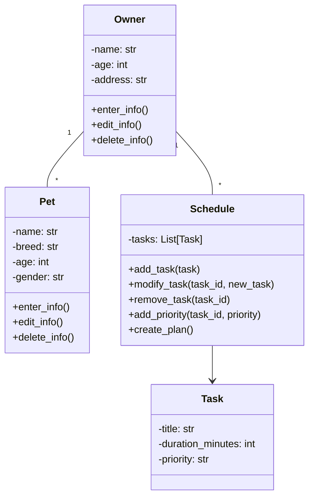

# PawPal+ System Design

## Class Diagram

## System Overview

 **Owner**: Manages owner information (name, age, address) with abilities to create, edit, and delete their profile
 **Pet**: Represents a pet with attributes (name, breed, age, gender) and similar CRUD operations as Owner
 **Task**: Individual pet care tasks with a title, duration, and priority level
 **Schedule**: Manages a collection of tasks for a pet, allowing you to add, modify, remove tasks, and adjust priorities.
